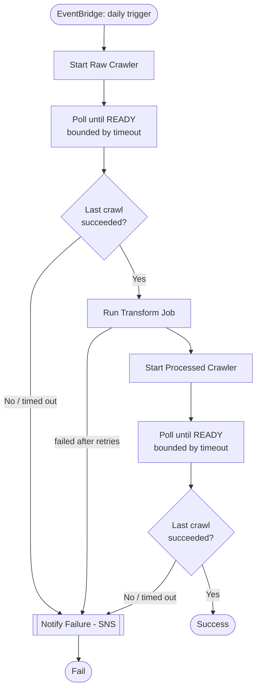

# E-Commerce ETL Pipeline on AWS

A production-ready, end-to-end ETL pipeline built entirely as Infrastructure as Code using Terraform. The platform ingests raw multi-region e-commerce order data into an AWS data lake, automatically catalogs schemas, applies data quality transformations with PySpark, and serves analytics-ready datasets through Amazon Athena.

Designed to operate unattended on a daily schedule, the pipeline includes workflow orchestration, intelligent failure handling, monitoring, alerting, and operational safeguards commonly found in production data platforms.

**Stack:** AWS S3 · AWS Glue · AWS Step Functions · AWS EventBridge · Amazon Athena · AWS SNS · AWS CloudWatch · Terraform

## What this project does

Regional stores (US, EU, UK, IN) upload daily order data as JSON files to Amazon S3. The source data intentionally reflects real-world challenges, including duplicate records from retried uploads, inconsistent date formats across regions, malformed currency codes, and missing values.

The pipeline automatically:

1. Ingests raw data into a cloud-based data lake
2. Discovers and catalogs schemas using AWS Glue Crawlers
3. Cleans, validates, deduplicates, and standardizes records with PySpark
4. Stores curated datasets in a queryable analytics layer
5. Makes data available for ad-hoc analysis through Amazon Athena
6. Executes on a daily schedule via EventBridge and Step Functions
7. Monitors execution health and generates alerts on failures

## Architecture


## Data Flow


## Orchestration & failure handling

The pipeline is orchestrated by a single Step Functions state machine. Both crawler
stages follow the same poll-with-timeout pattern shown once below.



## Tech stack

| Layer            | Service                        |
| ---------------- | ------------------------------ |
| Storage          | Amazon S3                      |
| Schema discovery | AWS Glue Crawlers              |
| Transformation   | AWS Glue Jobs (PySpark)        |
| Metadata catalog | AWS Glue Data Catalog          |
| Ad hoc querying  | Amazon Athena                  |
| Orchestration    | AWS Step Functions             |
| Scheduling       | Amazon EventBridge             |
| Alerting         | Amazon SNS + CloudWatch Alarms |
| Infrastructure   | Terraform                      |

---

## Key Highlights

Building the pipeline was only part of the challenge. A significant focus of this project was engineering for reliability, observability, security, and maintainability. These are the qualities that determine whether a solution can operate confidently in production. The platform incorporates a range of production-grade patterns commonly found in enterprise data systems, from intelligent failure recovery and multi-layer monitoring to least-privilege security and fully reproducible infrastructure.

- **Resilient failure handling** — Implements intelligent retries with exponential backoff for transient AWS failures, while permanent errors fail fast to avoid wasted execution time and accelerate troubleshooting.

- **Accurate health monitoring** — Validates AWS Glue crawler outcomes using `LastCrawl.Status`, ensuring downstream processes react to actual execution success or failure rather than infrastructure state alone.

- **Fail-safe execution controls** — Uses bounded polling and workflow-level timeouts to prevent stalled crawlers or long-running processes from hanging indefinitely.

- **Multi-layered alerting** — Combines in-workflow SNS notifications with independent CloudWatch alarms, providing redundant monitoring and ensuring failures remain visible even if one notification path is unavailable.

- **Security by design** — Applies least-privilege IAM principles with dedicated roles for each AWS service, minimizing risk and improving auditability.

- **Infrastructure as Code** — Entire platform provisioned through Terraform, including encryption, lifecycle policies, orchestration, monitoring, and access controls, enabling reproducible and version-controlled deployments.

- **Safe infrastructure evolution** — Uses Terraform `moved` blocks to manage state migrations during refactoring, preventing unnecessary resource recreation and reducing operational risk.

### **Result:** A secure, observable, and fault-tolerant data platform built with production-grade engineering practices rather than a proof-of-concept mindset.

## Project structure

```
terraform/
├── main.tf              # provider config, terraform block
├── variables.tf          # all input variables
├── outputs.tf             # all outputs
├── s3.tf                  # raw, processed, glue-assets, athena-results buckets
├── iam.tf                  # every IAM role and policy
├── glue.tf                  # Glue database, crawlers, transform job
├── athena.tf                 # Athena workgroup + saved queries
├── step_functions.tf          # orchestration + failure handling
├── sns.tf                      # failure alert topic
├── cloudwatch.tf                 # alarms watching the state machine
├── moved.tf                       # state migration for a mid-project rename
├── terraform.tfvars.example        # copy to terraform.tfvars and fill in
└── .gitignore

utils/
├── transform_orders.py		# the Glue PySpark transformation job
├── data_quality_check.py		# data quality check on processed data
└── generate_sample_data.py		# generate data

docs/diagrams/
├── architecture.png       # AWS service topology
└── data-flow.png          # data movement through the pipeline
```

## Setup

1. Copy `terraform.tfvars.example` to `terraform.tfvars` and fill in your values
   (at minimum, set `alert_email` if you want failure emails).
2. Upload the transform script to the Glue assets bucket:
   ```bash
   aws s3 cp scripts/transform_orders.py s3://<glue-assets-bucket>/scripts/transform_orders.py
   ```
3. Deploy the infrastructure:
   ```bash
   terraform init
   terraform plan
   terraform apply
   ```
4. Upload sample data:
   ```bash
   aws s3 sync ./sample_data/output/raw/ s3://<raw-bucket>/raw/
   ```
5. Manually trigger one Step Functions execution from the AWS Console to confirm
   the pipeline runs end to end before relying on the daily schedule.

## Roadmap

- [ ] Explicit data quality checks (e.g. Great Expectations) as a pipeline step
- [ ] CI/CD via GitHub Actions
- [ ] IAM least-privilege audit + Secrets Manager
- [ ] Amazon Redshift as an alternative serving layer for concurrent BI workloads

## Key Outcomes

This project demonstrates:

- Event-driven data pipeline orchestration
- Large-scale data transformation with PySpark
- Production-grade workflow resilience and monitoring
- Infrastructure-as-Code using Terraform
- Data lake architecture on AWS
- Secure cloud engineering using least-privilege IAM
